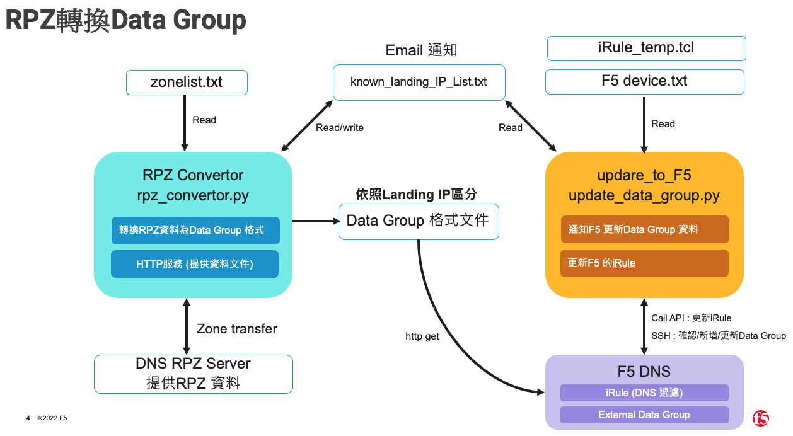

# RPZ 至 F5 Data Group 自動化專案

## 專案描述

本專案旨在自動化處理 RPZ (Response Policy Zone) 資料，將其轉換為適用於 F5 BIG-IP 的外部 Data Group 檔案格式，並自動觸發 F5 設備更新這些 Data Group 的來源，以實現基於 RPZ 的 DNS 防火牆或策略路由。

主要流程包含：

1. 定期透過 dig axfr 從指定的 DNS 伺服器獲取 RPZ zone 資料。
2. 解析 FQDN (域名) 和 IP (網段/主機) 類型的 RPZ 記錄。
3. 針對 FQDN 記錄，根據其解析到的 Landing IP 地址進行分類，產生對應的 Data Group 檔案 (適用於 iRule 中按 Landing IP 處理的邏輯)。
4. 監控特定 FQDN Zone (例如 rpztw.) 的 Landing IP 是否出現變化，並在發現新 IP 時發送 Email 通知。
5. 針對 IP 記錄，產生包含 host 或 network 格式的 Data Group 檔案。
6. 啟動一個本地 HTTP 伺服器，提供產生的 Data Group 檔案供 F5 下載。
7. 定期透過 SSH 連接多台 F5 設備，執行 tmsh 指令，更新 F5 上設定的外部 Data Group 的 source-path，使其指向本地 HTTP 伺服器提供的最新檔案。
8. 當第三步驟出現新增刪除的Landing IP , 除了Data Group Source 更新之外，系統會使用API方法更新F5 上面指定的irule內容。

## 系統架構

## 專案組件

本專案主要由以下幾個部分組成：

1. **RPZ 轉換器腳本 (rpz_converter.py)**:
   - 核心處理邏輯，負責獲取、解析 RPZ 資料，產生 Data Group 檔案。
   - 內含 Landing IP 監控與 Email 通知功能。
   - 內建簡易 HTTP 伺服器，用於提供產生的檔案。
   - 應作為背景服務持續運行。

2. **F5 更新腳本 (dynamic_f5_updater.py)**:
   - 負責讀取 F5 設備列表和登入憑證（來自環境變數）。
   - 動態產生需要更新的 Data Group 列表及其對應的檔案 URL。
   - 透過 SSH 連接 F5 並執行 tmsh 指令 (管理 Data Group) 以及透過 iControl REST API (管理 iRule)。
   - 應作為背景服務定期運行。

3. **F5 iRule (dns_rpz_irule.tcl)**:
   - 實際在 F5 上執行的 DNS 流量處理邏輯。
   - 使用 class match 或 matchclass 指令，根據轉換器產生的外部 Data Group 內容來判斷 DNS 查詢並執行相應動作（例如攔截、改寫回應等）。
   - 其 dg_ip_map 或類似邏輯需要與轉換器產生的 Data Group 名稱保持一致。

4. **設定檔**:
   - rpz_fqdn_zone.txt: 定義需要處理的 FQDN 類型的 RPZ Zone 列表。
   - rpz_ip_zone.txt: 定義需要處理的 IP 類型的 RPZ Zone 列表。
   - f5_devices.txt: 定義需要更新的 F5 設備 IP、登入用戶名和設備名稱（**不含密碼**）。
   - known_landing_ips.txt (可選): 儲存已知的 Landing IP，用於監控和檔案產生。若不存在，腳本會使用預設值，並可配置為自動更新。

5. **輸出目錄 (f5_datagroups/)**:
   - 由 rpz_converter.py 自動建立，存放所有產生的 Data Group .txt 檔案。
   - HTTP 伺服器會以此目錄作為根目錄。

6. **日誌檔**:
   - rpz_converter.log: 轉換器腳本的運行日誌。
   - f5_updater.log: F5 更新腳本的運行日誌。
   - (若使用 Systemd) journalctl: Systemd 服務的標準輸出和錯誤日誌。

## 近期主要功能更新 (摘要)

在過去數週的開發與測試中，本專案新增及完善了以下主要功能：

1. **TSIG Key 支援**:
   - rpz_converter.py 現在支援使用 TSIG Key 來進行 DNS Zone Transfer (AXFR) 驗證，增強了從 DNS 伺服器獲取資料的安全性。相關 Key 字串可在腳本中設定。

2. **密碼管理改進 (環境變數)**:
   - **SMTP 密碼**: rpz_converter.py 中的 Email 通知功能，其 SMTP 登入密碼已改為從環境變數 (SMTP_APP_PASSWORD) 讀取，避免密碼硬編碼在腳本中。
   - **F5 設備密碼**: dynamic_f5_updater.py 腳本現在從環境變數 (例如 F5_PASSWORD_F5_Device1) 讀取各 F5 設備的登入密碼，取代了原先可能將密碼存於設定檔的方式。

3. **Landing IP 自動化管理 (known_landing_ips.txt)**:
   - rpz_converter.py 能夠監控指定的 RPZ Zone (MONITORED_ZONE)。
   - 當偵測到新的 Landing IP 時，可配置為自動將新 IP 加入 known_landing_ips.txt。
   - 同時，也能偵測已不再使用的 Landing IP，並可配置為自動從 known_landing_ips.txt 中移除這些失效的 IP。
   - 此檔案的準確性是後續自動化 Data Group 和 iRule 更新的基礎。

4. **F5 Data Group 自動化管理增強**:
   - dynamic_f5_updater.py 現在會根據最新的 known_landing_ips.txt 和 Zone 設定檔，動態產生需要管理的 Data Group 列表。
   - **自動建立 Data Group**: 如果 F5 上不存在腳本預期要更新的外部 Data Group 物件，腳本會嘗試自動使用 tmsh create ltm data-group external ... 指令來建立它，然後再更新其 source-path。
   - **修正建立語法**: 針對不同 TMOS 版本，優化了 tmsh create 指令的語法，採用更通用的方式（先建立空物件再修改，或在 create 時直接指定 source-path 並帶有回退機制）。

5. **iRule 自動更新改用 iControl REST API**:
   - dynamic_f5_updater.py 更新 F5 iRule 的方式已從原先透過 SSH 執行 tmsh modify rule ... definition ... 改為使用 **F5 iControl REST API**。
   - 腳本會讀取一個本地的 iRule 範本檔案 (dns_rpz_irule_template.tcl)。
   - 根據最新的 known_landing_ips.txt 動態產生 iRule 中的 dg_ip_map (Data Group 與 Landing IP 的對應列表)。
   - 將包含最新 dg_ip_map 的完整 iRule 內容，透過 HTTPS PATCH 請求發送到 F5 的 API 端點，實現 iRule 的更新。
   - 這種方式能更可靠地處理包含多行內容、特殊字元及非 ASCII 字元 (如中文註解，雖然建議移除) 的 iRule，避免了命令列解析問題。

6. **詳細的安裝與設定 SOP**:
   - 建立了一份完整的標準作業程序 (SOP)，涵蓋在新 Ubuntu 伺服器上從頭開始安裝、設定並執行這兩個腳本的所有步驟，包括用戶建立、依賴安裝、檔案放置、權限設定、環境變數設定 (透過 Systemd)、Systemd 服務建立、防火牆設定及監控帳號設定。

7. **錯誤處理與日誌記錄優化**:
   - 在兩個腳本中都增強了錯誤捕捉和日誌記錄，方便追蹤問題和了解腳本運行狀態。

8. **可配置的功能開關**:
   - 加入了如 AUTO_UPDATE_KNOWN_IPS_FILE (是否自動更新 Landing IP 列表檔案)、ENABLE_IRULE_AUTO_UPDATE (是否啟用 iRule 自動更新)、MANAGE_RPZIP_BLACKLIST (是否管理特定的合併 Data Group) 等設定開關，讓使用者可以根據需求調整自動化程度。

## 詳細安裝操作請參考SOP.md

授權條款 (License)
MIT License

Copyright (c) 2025 UNIFORCE

Permission is hereby granted, free of charge, to any person obtaining a copy
of this software and associated documentation files (the "Software"), to deal
in the Software without restriction, including without limitation the rights
to use, copy, modify, merge, publish, distribute, sublicense, and/or sell
copies of the Software, and to permit persons to whom the Software is
furnished to do so, subject to the following conditions:

The above copyright notice and this permission notice shall be included in all
copies or substantial portions of the Software.

THE SOFTWARE IS PROVIDED "AS IS", WITHOUT WARRANTY OF ANY KIND, EXPRESS OR
IMPLIED, INCLUDING BUT NOT LIMITED TO THE WARRANTIES OF MERCHANTABILITY,
FITNESS FOR A PARTICULAR PURPOSE AND NONINFRINGEMENT. IN NO EVENT SHALL THE
AUTHORS OR COPYRIGHT HOLDERS BE LIABLE FOR ANY CLAIM, DAMAGES OR OTHER
LIABILITY, WHETHER IN AN ACTION OF CONTRACT, TORT OR OTHERWISE, ARISING FROM,
OUT OF OR IN CONNECTION WITH THE SOFTWARE OR THE USE OR OTHER DEALINGS IN THE
SOFTWARE.
