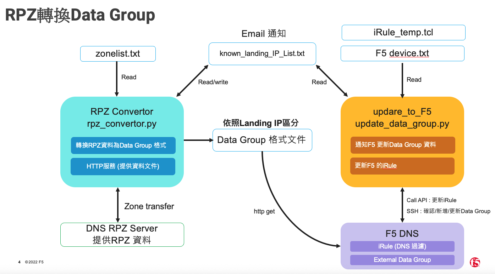

# F5 RPZ Blacklist Automation

自動化DNS RPZ黑名單數據轉換及F5設備更新系統。此系統允許從權威DNS伺服器獲取RPZ區域數據，將其轉換為F5數據組格式，然後自動更新多台F5設備。

## 系統架構

本系統由兩個主要組件組成：

1. **RPZ轉換器** (`rpz_converter_v2.py`) - 將DNS RPZ區域數據轉換為F5數據組格式，並通過HTTP伺服器提供這些數據
2. **F5更新器** (`update_data_group_v2.py`) - 定期連接到F5設備並更新外部數據組來源路徑



## 功能特點

### RPZ轉換器
- 從DNS伺服器獲取RPZ區域數據（FQDN和IP）
- 將數據轉換為F5兼容的數據組格式
- ~~合併來自多個區域的數據~~ (for台哥大，此功能移除，區域數據各自獨立）
- 通過HTTP伺服器提供轉換後的數據
- 定期自動刷新區域數據

### F5更新器
- 從配置文件讀取F5設備資訊
- 定期SSH登入每台F5設備
- 更新外部數據組的來源路徑
- 詳細的操作日誌記錄

## 系統要求

- Python 3.6+
- dig
- 可以訪問DNS伺服器進行區域傳輸(AXFR)的權限
- 可以SSH連接到所有F5設備的伺服器
- 必要的Python套件: `paramiko`, `ipaddress`

## 文件結構

```
├── rpz_converter_v2.py          # RPZ轉換器主腳本
├── update_data_group_v2.py         # F5更新器主腳本
├── rpz_fqdn_zone.txt            # FQDN區域列表
├── rpz_ip_zone.txt              # IP區域列表
├── f5_devices.txt               # F5設備資訊
├── f5_datagroups/               # 轉換後的數據輸出目錄
│   ├── rpztw_blacklist.txt      # rpztw dat group data
│   ├── phishingtw_blacklist.txt # phishingtw data group data
│   └── rpzip_blacklist.txt      # rpzip dat group data
├── rpz_converter.log            # RPZ轉換器日誌
└── f5_updater.log               # F5更新器日誌
```

## 安裝步驟

1. 克隆此Git儲存庫：
```bash
git clone https://github.com/yourusername/f5-rpz-blacklist-automation.git
cd f5-rpz-blacklist-automation
```

2. 安裝所需的Python套件：
```bash
pip install paramiko ipaddress
```

3. 配置區域列表和F5設備資訊（見下文）

## 配置文件說明

### 1. FQDN區域列表 (rpz_fqdn_zone.txt)

包含所有FQDN類型的RPZ區域名稱，每行一個。例如：
```
rpztw
phishingtw
```

### 2. IP區域列表 (rpz_ip_zone.txt)

包含所有IP類型的RPZ區域名稱，每行一個。例如：
```
rpzip
```

### 3. F5設備資訊 (f5_devices.txt)

包含所有需要更新的F5設備資訊，格式為：
```
IP地址,用戶名,密碼,設備名稱(可選)
```

範例：
```
10.8.34.186,admin,password,F5-Device1
# 使用 # 可以註釋掉不需要的設備
```

## RPZ轉換器 (rpz_converter_v1.py)

### 設定參數

可在腳本中修改以下參數：
```python
DNS_SERVER = "10.8.38.227"        # 需要查詢的DNS伺服器
UPDATE_INTERVAL = 5 * 60          # 更新間隔，單位為秒
FQDN_ZONE_LIST_FILE = "rpz_fqdn_zone.txt"
IP_ZONE_LIST_FILE = "rpz_ip_zone.txt"
OUTPUT_DIR = "f5_datagroups"      # 輸出目錄
HTTP_PORT = 8080                  # HTTP伺服器端口
```

### 數據格式轉換

- **FQDN記錄**：將 `aaa.aaa.rpztw. 28800 IN A 1.1.1.1` 轉換為 `aaa.aaa := 1.1.1.1`
- **IP記錄**：將 `32.10.213.193.141.rpz-ip.rpzip. 28800 IN CNAME .` 轉換為 `host 141.193.213.10,`

### 使用方式

```bash
python rpz_converter_v2.py
```

啟動後，轉換器會：
1. 從DNS伺服器查詢所有配置的區域
2. 轉換數據並寫入輸出文件
3. 啟動HTTP伺服器（端口8080）提供這些文件
4. 每5分鐘自動刷新一次數據

## F5更新器 (update_data_group_v2.py)

### 設定參數

可在腳本中修改以下參數：
```python
# F5設備資訊文件
F5_DEVICES_FILE = "f5_devices.txt"
# HTTP服務器地址
HTTP_SERVER = "10.8.34.99:8080"

# 固定的命令列表，不需要讀取zone列表文件
COMMANDS = [
    f"modify ltm data-group external rpz_rpztw source-path http://{HTTP_SERVER}/rpztw_blacklist.txt",
    f"modify ltm data-group external rpz_phishingtw source-path http://{HTTP_SERVER}/phishingtw_blacklist.txt",
    f"modify ltm data-group external rpz_ip source-path http://{HTTP_SERVER}/rpzip_blacklist.txt"
]
```

> 注意：請確保COMMANDS中的IP地址(10.8.34.99)與運行RPZ轉換器的伺服器IP一致

### 使用方式

```bash
python update_data_group_v2.py
```

啟動後，更新器會：
1. 讀取F5設備資訊
2. 連接到每台設備並執行更新命令
3. 每5分鐘自動重複一次操作

## 完整部署流程

1. 配置 `rpz_fqdn_zone.txt` 和 `rpz_ip_zone.txt` 文件，添加需要的RPZ區域
2. 配置 `f5_devices.txt` 文件，添加需要更新的F5設備資訊
3. 修改 `rpz_converter_v2.py` 中的DNS_SERVER參數為您的DNS伺服器IP
4. 修改 `update_data_group_v2.py` 中的COMMANDS參數，確保IP地址為運行RPZ轉換器的伺服器IP
5. 首先啟動RPZ轉換器：
   ```bash
   python rpz_converter_v2.py
   ```
6. 然後啟動F5更新器（在同一台服務器或能夠訪問RPZ轉換器HTTP服務的另一台服務器上）：
   ```bash
   python update_data_group_v2.py
   ```

## 設定為系統服務 (Linux)

### RPZ轉換器服務

1. 創建服務文件：
```bash
sudo vi /etc/systemd/system/rpz-converter.service
```

2. 添加以下內容：
```
[Unit]
Description=RPZ Converter Service
After=network.target

[Service]
Type=simple
User=yourusername
WorkingDirectory=/path/to/f5-rpz-blacklist-automation
ExecStart=/usr/bin/python3 /path/to/f5-rpz-blacklist-automation/rpz_converter_v2.py
Restart=on-failure
RestartSec=10
StandardOutput=syslog
StandardError=syslog
SyslogIdentifier=rpz-converter

[Install]
WantedBy=multi-user.target
```

3. 啟用並啟動服務：
```bash
sudo systemctl daemon-reload
sudo systemctl enable rpz-converter.service
sudo systemctl start rpz-converter.service
```

### F5更新器服務

1. 創建服務文件：
```bash
sudo vi /etc/systemd/system/f5-updater.service
```

2. 添加以下內容：
```
[Unit]
Description=F5 Data Group Updater Service
After=network.target

[Service]
Type=simple
User=yourusername
WorkingDirectory=/path/to/f5-rpz-blacklist-automation
ExecStart=/usr/bin/python3 /path/to/f5-rpz-blacklist-automation/update_data_group_v2.py
Restart=on-failure
RestartSec=10
StandardOutput=syslog
StandardError=syslog
SyslogIdentifier=f5-updater

[Install]
WantedBy=multi-user.target
```

3. 啟用並啟動服務：
```bash
sudo systemctl daemon-reload
sudo systemctl enable f5-updater.service
sudo systemctl start f5-updater.service
```

## 故障排除

### RPZ轉換器常見問題

1. **無法獲取區域數據**:
   - 確認DNS伺服器IP地址是否正確
   - 確認伺服器允許進行區域傳輸(AXFR)
   - 檢查防火牆規則是否允許TCP 53端口
   - 驗證區域名稱是否正確

2. **HTTP伺服器無法啟動**:
   - 確認端口8080是否被其他程序占用
   - 檢查防火牆規則是否允許TCP 8080端口
   - 確保有足夠權限綁定該端口

### F5更新器常見問題

1. **SSH連接失敗**:
   - 確認F5設備的IP地址是否正確
   - 確認用戶名和密碼是否正確
   - 確認網路連接是否正常
   - 檢查F5設備SSH服務是否啟用

2. **命令執行失敗**:
   - 確認用戶是否有足夠權限執行命令
   - 檢查數據組名稱是否正確
   - 確認HTTP來源是否可訪問（可用瀏覽器訪問 http://10.8.34.99:8080/rpztw_blacklist.txt 進行測試）

## 安全考量

- `f5_devices.txt` 包含敏感認證信息，請確保適當的文件權限
- 考慮使用更安全的認證管理方式，如SSH密鑰認證
- HTTP伺服器目前沒有認證機制，請確保它只在安全的內部網絡上運行
- 定期更改F5設備的密碼，並相應更新配置文件

## 開發與貢獻

歡迎提交問題報告和改進建議。請遵循以下步驟:
1. Fork 此儲存庫
2. 創建您的功能分支 (`git checkout -b feature/AmazingFeature`)
3. 提交您的更改 (`git commit -m 'Add some AmazingFeature'`)
4. 推送到分支 (`git push origin feature/AmazingFeature`)
5. 開啟 Pull Request

## 授權信息

此為特殊需求，不是特定產業用不到。但是可以參考想法。
如有需要，請自行取用。
